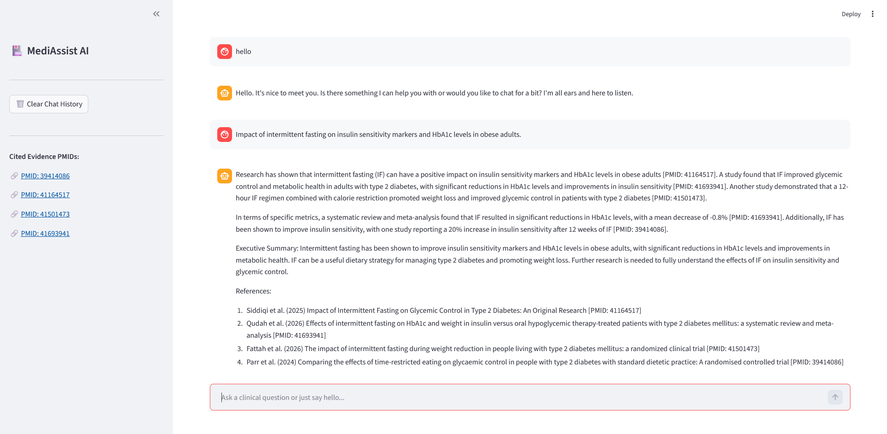

# 🏥 MediAssist AI | Clinical Research Assistant

MediAssist AI is a smart chatbot project built to help people find answers from real medical research. It uses RAG (Retrieval-Augmented Generation) to search through actual PubMed medical papers and uses an AI model to give accurate answers with proper citations.

---

## 🎯 The Problem

It takes a lot of time to read through tons of medical papers to find specific answers (like how intermittent fasting affects diabetes). Also, normal AI chatbots sometimes make up facts or give fake links.

MediAssist solves this by downloading real data from PubMed and forcing the AI to only answer using that downloaded data. It also includes real PubMed IDs (PMIDs) so you can verify the information yourself.

---

## ✨ Key Features

* **Smart Chat Routing:**  
  The app can tell if you are just saying `"hello"` or asking a complex medical question. It handles casual chat normally but uses the heavy RAG system for medical questions.

* **Medical RAG Pipeline:**  
  Uses LangChain and ChromaDB to search our local database and find the most relevant paragraphs for your query.

* **Automated PubMed Scraping:**  
  Custom Python scripts automatically search and download recent medical abstracts directly from the NCBI PubMed website.

* **Accurate Citations:**  
  The AI is strictly prompted to include exact PubMed IDs inline (like `[PMID: 41164517]`) and list its references at the end.

* **Interactive UI:**  
  Built with Streamlit, the app remembers your chat history and automatically updates a sidebar with clickable links to the papers the AI cited.

---

## 🛠️ Technology Stack

* **Frontend UI:** Streamlit
* **AI Model:** Groq (`llama-3.3-70b-versatile`)
* **Framework:** LangChain
* **Vector Database:** ChromaDB
* **Embeddings:** HuggingFace (`sentence-transformers/all-MiniLM-L6-v2`)
* **Router:** Semantic Router

---

## 📂 Project Structure

```text
📦 mediassist-ai
 ┣ 📜 app.py                 # The main Streamlit website and chat logic
 ┣ 📜 rag_chain.py           # The LangChain setup that connects the DB, AI, and prompts
 ┣ 📜 router.py              # Logic to separate simple chats from medical questions
 ┣ 📜 pubmed.py              # Functions to connect to the PubMed API
 ┣ 📜 fetch_data.py          # Script to download medical papers and save them as JSON
 ┣ 📜 ingest_from_json.py    # Script to split the JSON data and store it in ChromaDB
 ┣ 📜 query_test.py          # A simple terminal script to test if the database works
 ┣ 📜 requirements.txt       # List of Python packages needed for the project
 ┣ 📜 .gitignore             # Hides secret keys and virtual environments from GitHub
 ┣ 📜 pubmed_articles_backup.json # The raw downloaded research data
 ┗ 📂 chroma_store/          # The actual local database folder
```

---

## ⚙️ How It Works

### 1. Get the Data
`fetch_data.py` searches PubMed for specific topics and saves the research papers locally.

### 2. Store the Data
`ingest_from_json.py` cuts the papers into smaller chunks and saves them in our local ChromaDB vector database.

### 3. Understand the User
When you type a message in the app, `router.py` checks if it's a general greeting or a medical question.

### 4. Generate the Answer
For medical questions, `rag_chain.py` searches the database for the right text, sends it to the Groq AI model along with your chat history, and prints a fact-checked answer.

---

## 🚀 How to Run the Project Locally

### 1. Clone the code to your computer

```bash
git clone <your-repository-url>
cd mediassist-ai
```

### 2. Create a virtual environment and install packages

```bash
python -m venv venv
source venv/bin/activate  # On Windows use: venv\Scripts\activate
pip install -r requirements.txt
```

### 3. Add your API key

Create a file named `.env` in the main folder and add your Groq API key:

```env
GROQ_API_KEY=your_groq_api_key_here
```

### 4. (Optional) Update the Database

If you want to download fresh papers and rebuild the database from scratch:

```bash
python fetch_data.py
python ingest_from_json.py
```

### 5. Start the App

```bash
streamlit run app.py
```

---

## 🌐 Live Demo

🔗 **Streamlit Demo:**  
[Streamlit App Link](https://medi-assist-ai-rag.streamlit.app/)

---

## 📸 Application Screenshot



---

## 📌 Example Use Cases

- Researching diseases and treatments
- Understanding effects of diets and lifestyle changes
- Finding evidence-backed medical information
- Quickly summarizing recent PubMed research
- Educational medical Q&A with verified citations

---

## ⚠️ Disclaimer

This project is developed for **educational and learning purposes only**.

It is **not intended for real-world clinical use, medical diagnosis, treatment, or commercial deployment**. The information generated by the system should not be considered professional medical advice.

Always consult qualified healthcare professionals for medical decisions.